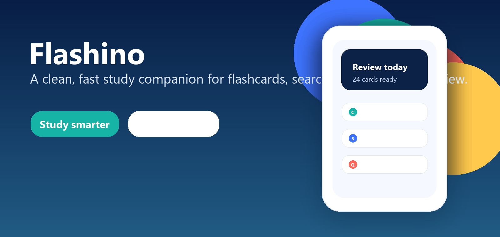
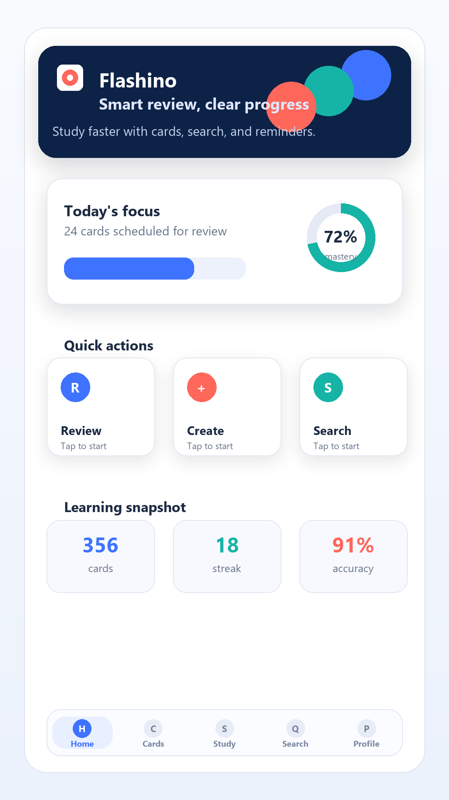
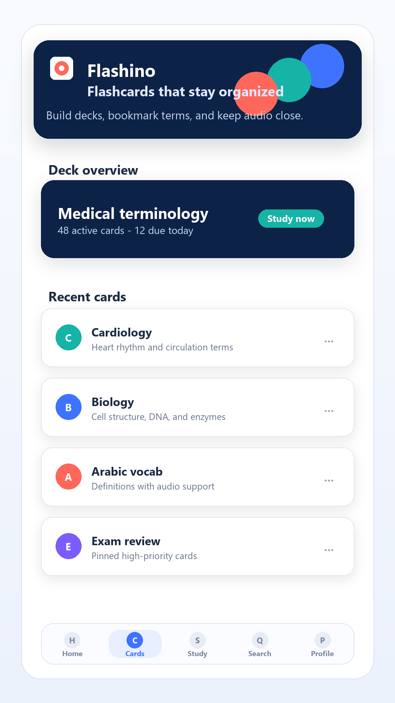
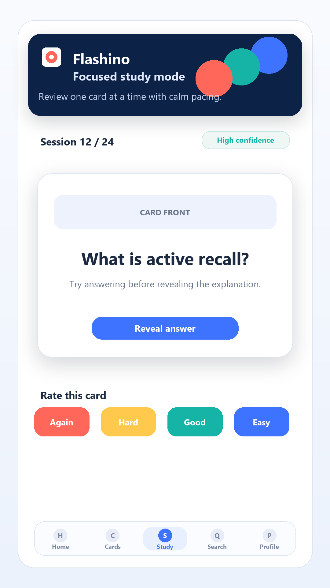
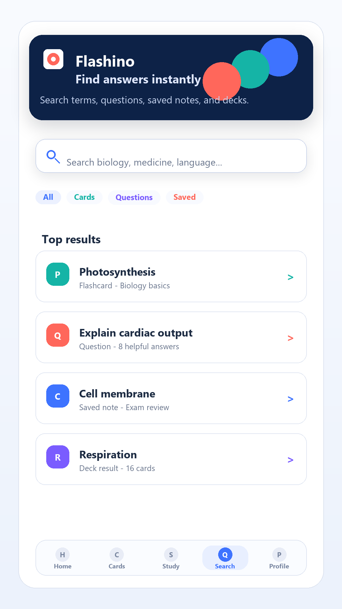
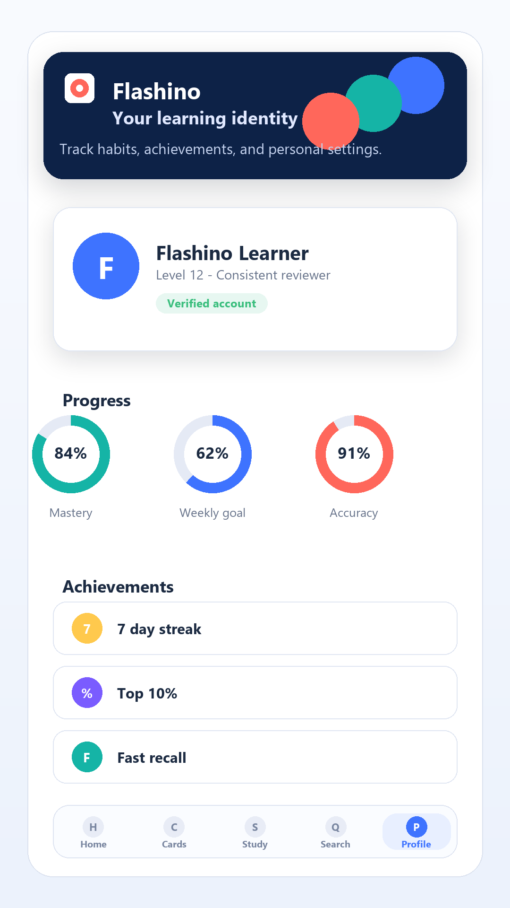

# Flashino

<p align="center">
  
</p>

<p align="center">
  <a href="https://github.com/drnopoh2810-spec/Flashino/actions/workflows/android-ci.yml"></a>
  <a href="https://github.com/drnopoh2810-spec/Flashino/releases/latest"></a>
  <a href="LICENSE"></a>
  
</p>

<p align="center">
  <strong>Flashino is a modern Android learning app for flashcards, study review, Q&A, search, profiles, and guided study reminders.</strong>
</p>

<p align="center">
  <a href="#english">English</a> |
  <a href="#arabic">العربية</a> |
  <a href="https://github.com/drnopoh2810-spec/Flashino/releases/latest">Latest APK</a>
</p>

<p align="center">
  
</p>

## Screenshots

<table>
  <tr>
    <td align="center"></td>
    <td align="center"></td>
    <td align="center"></td>
    <td align="center"></td>
    <td align="center"></td>
  </tr>
  <tr>
    <td align="center">Home</td>
    <td align="center">Flashcards</td>
    <td align="center">Study</td>
    <td align="center">Search</td>
    <td align="center">Profile</td>
  </tr>
</table>

---

<a id="english"></a>

## English

### Overview

Flashino is an Android learning application built for fast review sessions and practical self-study workflows. It combines flashcards, spaced study flows, Q&A, profile management, search, reminders, media support, and GitHub Release based app updates in a single Kotlin Android app.

The project is designed for production-style Android delivery: typed configuration through Gradle, protected runtime secrets, CI validation, release APK generation, and store-ready visual assets.

### Key Features

- Flashcard management with review-focused study screens.
- Study mode with answer reveal and daily review reminders.
- Question and answer flow for community-style learning support.
- Search support through Algolia-backed indexing.
- Profile, account, bookmarks, leaderboard, and user progress areas.
- Local persistence with Room and offline-friendly data access patterns.
- Firebase Authentication and Firestore integration.
- Supabase configuration hooks for backend services.
- Cloudinary media upload support.
- AdMob native and rewarded ad configuration.
- In-app update flow connected to the latest GitHub Release APK.
- Arabic and English app resources with RTL support.

### Tech Stack

| Area | Technology |
| --- | --- |
| Language | Kotlin |
| UI | Jetpack Compose, Material 3 |
| Architecture | MVVM, Repository pattern, Hilt dependency injection |
| Local data | Room, DataStore, Paging 3 |
| Backend services | Firebase Auth, Firestore, Supabase-ready configuration |
| Search | Algolia |
| Media | Cloudinary, Android media APIs, Media3 |
| Ads | Google Mobile Ads / AdMob |
| Background work | WorkManager |
| Networking | Retrofit, OkHttp |
| CI/CD | GitHub Actions |
| Releases | GitHub Releases with APK assets |

### Repository Structure

```text
app/                         Android application module
app/src/main/java/           Kotlin source code
app/src/main/res/            Android resources, strings, launcher assets
docs/supabase/               Supabase schema and setup notes
docs/assets/readme/          README banner and generated UI mockups
icon/                        App icon exports
scripts/                     Validation and automation scripts
store_assets/amazon/         Store icons, screenshots, and promotional images
.github/workflows/           CI and release workflows
```

### Requirements

- Android Studio Ladybug or newer is recommended.
- JDK 17.
- Android SDK 35.
- Gradle wrapper included in the repository.
- A configured Firebase project when using auth and Firestore.
- Required service keys supplied through local files or GitHub Actions secrets.

### Local Setup

Clone the repository:

```powershell
git clone https://github.com/drnopoh2810-spec/Flashino.git
cd Flashino
```

Create local configuration files when needed:

```text
secrets.properties
release-signing.properties
```

Do not commit these files. They are intentionally ignored and should only exist on trusted developer machines or in GitHub Actions secrets.

### Runtime Configuration

The app reads runtime values from Gradle properties or `secrets.properties`.

| Variable | Purpose |
| --- | --- |
| `ADMOB_APP_ID` | AdMob application ID |
| `ADMOB_NATIVE_AD_UNIT_ID` | Native ad unit ID |
| `ADMOB_REWARDED_AD_UNIT_ID` | Rewarded ad unit ID |
| `ADMOB_NATIVE_FREQUENCY` | Native ad insertion frequency |
| `SUPABASE_URL` | Supabase project URL |
| `SUPABASE_ANON_KEY` | Supabase anonymous key |
| `ALGOLIA_APP_ID` | Algolia application ID |
| `ALGOLIA_SEARCH_KEY` | Algolia search-only key |
| `CLOUDINARY_ACCOUNTS_JSON` | Cloudinary account configuration |
| `GOOGLE_WEB_CLIENT_ID` | Google Sign-In web client ID |
| `AUDIO_BACKEND_BASE_URL` | Optional audio backend base URL |

Release signing values are expected in `release-signing.properties` locally or secure GitHub Actions secrets in CI.

### Build

Run unit tests:

```powershell
.\gradlew.bat testDebugUnitTest
```

Build a debug APK:

```powershell
.\gradlew.bat assembleDebug
```

Build a release APK:

```powershell
.\gradlew.bat assembleRelease
```

Validate runtime configuration hygiene:

```powershell
python scripts\validate_config_security.py
```

### Releases and Auto Updates

Flashino checks the latest GitHub Release from:

```text
https://github.com/drnopoh2810-spec/Flashino/releases/latest
```

When a newer APK is available, the app downloads the release asset and opens the Android package installer. Android does not allow ordinary apps to silently install APK updates without user approval, so the installer confirmation remains part of the flow on standard devices.

### Store Assets

Store-ready images are available in:

```text
store_assets/amazon/
```

The folder includes app icons, phone screenshots, tablet screenshots, and promotional artwork for store submissions.

The README preview images are generated mockups stored in:

```text
docs/assets/readme/
```

### app-ads.txt

If the app uses AdMob in production, publish `app-ads.txt` at the root of the developer website listed in the store listing:

```text
https://your-domain.com/app-ads.txt
```

The file belongs on the developer website, not inside the APK.

### Security Notes

- Do not commit `secrets.properties`, signing keys, keystores, service account JSON files, or raw API secrets.
- Keep GitHub Actions secrets as the source of truth for CI release builds.
- Use search-only keys on client apps where possible.
- Keep server-only keys on backend services.
- Run the security validation script before publishing a release.

### License

This project is licensed under the MIT License. See [LICENSE](LICENSE).

---

<a id="arabic"></a>

## العربية

### نظرة عامة

Flashino هو تطبيق Android تعليمي حديث مصمم للمراجعة السريعة وتنظيم الدراسة اليومية. يجمع التطبيق بين البطاقات التعليمية، وضع المراجعة، الأسئلة والأجوبة، البحث، الملف الشخصي، التذكيرات، دعم الوسائط، ونظام تحديث يعتمد على آخر إصدار منشور في GitHub Releases.

المشروع مجهز بأسلوب قريب من الإنتاج: إعدادات تشغيل آمنة، فصل الأسرار عن الكود، فحوصات CI، بناء APK للإصدارات، وأصول جاهزة للمتاجر.

### المميزات الأساسية

- إدارة البطاقات التعليمية ومراجعتها.
- وضع دراسة مع إظهار الإجابة وتذكيرات يومية.
- قسم أسئلة وأجوبة لدعم التعلم.
- بحث سريع مدعوم بإعدادات Algolia.
- ملف شخصي، حساب، علامات محفوظة، لوحة ترتيب، وتتبع تقدم.
- تخزين محلي باستخدام Room ونمط مناسب للعمل عند ضعف الاتصال.
- تكامل Firebase Authentication وFirestore.
- إعدادات جاهزة للتكامل مع Supabase.
- دعم رفع الوسائط عبر Cloudinary.
- إعدادات إعلانات AdMob للإعلانات الأصلية والمكافأة.
- نظام تحديث من آخر APK منشور في GitHub Releases.
- موارد عربية وإنجليزية مع دعم اتجاه RTL.

### التقنيات المستخدمة

| المجال | التقنية |
| --- | --- |
| اللغة | Kotlin |
| الواجهة | Jetpack Compose, Material 3 |
| المعمارية | MVVM, Repository pattern, Hilt |
| التخزين المحلي | Room, DataStore, Paging 3 |
| الخدمات الخلفية | Firebase Auth, Firestore, Supabase-ready configuration |
| البحث | Algolia |
| الوسائط | Cloudinary, Android media APIs, Media3 |
| الإعلانات | Google Mobile Ads / AdMob |
| العمل في الخلفية | WorkManager |
| الشبكات | Retrofit, OkHttp |
| التكامل المستمر | GitHub Actions |
| الإصدارات | GitHub Releases مع ملفات APK |

### بنية المستودع

```text
app/                         وحدة تطبيق Android
app/src/main/java/           كود Kotlin
app/src/main/res/            موارد Android والنصوص والأيقونات
docs/supabase/               ملفات وإرشادات Supabase
docs/assets/readme/          بانر وصور تخيلية خاصة بملف README
icon/                        أيقونات التطبيق
scripts/                     سكربتات التحقق والأتمتة
store_assets/amazon/         صور وأيقونات المتجر
.github/workflows/           ملفات CI والإصدار
```

### المتطلبات

- يفضل Android Studio Ladybug أو أحدث.
- JDK 17.
- Android SDK 35.
- Gradle Wrapper موجود داخل المشروع.
- مشروع Firebase مهيأ عند استخدام تسجيل الدخول وFirestore.
- توفير مفاتيح الخدمات من ملفات محلية آمنة أو من GitHub Actions Secrets.

### تشغيل المشروع محليا

استنساخ المستودع:

```powershell
git clone https://github.com/drnopoh2810-spec/Flashino.git
cd Flashino
```

أنشئ ملفات الإعداد المحلية عند الحاجة:

```text
secrets.properties
release-signing.properties
```

لا تقم برفع هذه الملفات إلى GitHub. يجب أن تبقى على جهاز المطور أو داخل GitHub Secrets فقط.

### إعدادات التشغيل

يقرأ التطبيق القيم من Gradle properties أو من `secrets.properties`.

| المتغير | الاستخدام |
| --- | --- |
| `ADMOB_APP_ID` | معرف تطبيق AdMob |
| `ADMOB_NATIVE_AD_UNIT_ID` | معرف الإعلان الأصلي |
| `ADMOB_REWARDED_AD_UNIT_ID` | معرف إعلان المكافأة |
| `ADMOB_NATIVE_FREQUENCY` | معدل إدراج الإعلانات الأصلية |
| `SUPABASE_URL` | رابط مشروع Supabase |
| `SUPABASE_ANON_KEY` | مفتاح Supabase العام |
| `ALGOLIA_APP_ID` | معرف تطبيق Algolia |
| `ALGOLIA_SEARCH_KEY` | مفتاح البحث فقط في Algolia |
| `CLOUDINARY_ACCOUNTS_JSON` | إعدادات Cloudinary |
| `GOOGLE_WEB_CLIENT_ID` | معرف Google Web Client |
| `AUDIO_BACKEND_BASE_URL` | رابط خدمة الصوت الاختيارية |

قيم توقيع الإصدار يجب أن تبقى محلية في `release-signing.properties` أو داخل GitHub Actions Secrets.

### أوامر البناء

تشغيل اختبارات الوحدة:

```powershell
.\gradlew.bat testDebugUnitTest
```

بناء نسخة Debug:

```powershell
.\gradlew.bat assembleDebug
```

بناء نسخة Release:

```powershell
.\gradlew.bat assembleRelease
```

التحقق من أمان الإعدادات:

```powershell
python scripts\validate_config_security.py
```

### الإصدارات والتحديث التلقائي

يتحقق Flashino من آخر إصدار منشور هنا:

```text
https://github.com/drnopoh2810-spec/Flashino/releases/latest
```

عند وجود APK أحدث، يقوم التطبيق بتنزيل ملف الإصدار وفتح مثبت Android. لا يسمح Android للتطبيقات العادية بتثبيت APK بصمت كامل بدون موافقة المستخدم، لذلك تبقى خطوة تأكيد التثبيت مطلوبة على الأجهزة العادية.

### أصول المتجر

الأصول الجاهزة للمتاجر موجودة في:

```text
store_assets/amazon/
```

يشمل ذلك أيقونات التطبيق، لقطات شاشة للهاتف، لقطات شاشة للتابلت، وصورة ترويجية لاستخدامها في المتاجر.

صور المعاينة داخل README هي صور تخيلية مولدة للمستودع وموجودة في:

```text
docs/assets/readme/
```

### ملف app-ads.txt

إذا كان التطبيق يستخدم AdMob في الإنتاج، يجب نشر ملف `app-ads.txt` في جذر موقع المطور الموجود داخل صفحة التطبيق في المتجر:

```text
https://your-domain.com/app-ads.txt
```

هذا الملف يوضع على موقع المطور، وليس داخل التطبيق أو ملف APK.

### ملاحظات الأمان

- لا ترفع `secrets.properties` أو مفاتيح التوقيع أو ملفات keystore أو ملفات service account أو الأسرار الخام.
- اجعل GitHub Actions Secrets مصدر القيم الحساسة في بناء الإصدارات.
- استخدم مفاتيح بحث فقط داخل تطبيقات العميل متى أمكن.
- احتفظ بمفاتيح الخادم داخل الخدمات الخلفية فقط.
- شغل سكربت التحقق الأمني قبل نشر أي إصدار.

### الرخصة

هذا المشروع مرخص برخصة MIT. راجع [LICENSE](LICENSE).
